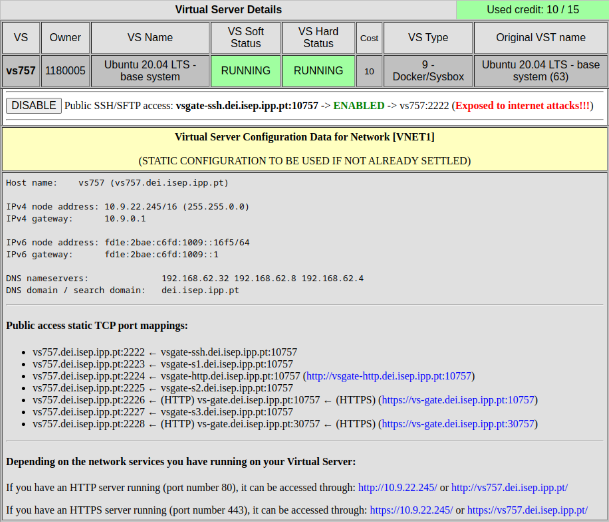

# UC 01: Breno Pacheco (1180005)

> Como administrador do sistema quero que o deployment de um dos módulos do
> RFP numa VM do DEI seja sistemático, validando de forma agendada com o plano
> de testes.

## Descrição da solução

Foi escolhido o módulo SPA (Single Page Application) para deployment. O módulo
SPA consiste em uma aplicação Web desenvolvida em __Javascript__ e empacotada
(_bundled_) utilizando módulos de __Node.js__. Depois de empacotada, deve ser
servida a partir de um servidor **HTTP** que fornece os seguintes ficheiros:

- Ficheiro _index.html_
- Diretório _./assets_ com demais recursos

Optou-se por utilizar um servidor do DEI com sistema base __Ubuntu 20.04
LTS__, acessível através de conexão **SSH**, ao qual é instalado e iniciado um
serviço de servidor HTTP **Nginx**.

Um usuário especifico (denominado `pipeline`) possui permissão para modificar
o conteúdo servido pelo servidor, não detendo outras permissões dentro do
sistema.

No repositório do projeto, configuram-se as `pipelines` para que, quando
houverem novos commits na _branch_ **master**, o projeto seja empacotado e
enviado ao servidor, sendo os arquivos fornecidos pelo serviço sobstitúidos no
mesmo.



## Acesso ao servidor

É possível aceder ao servidor via protocolo secure-shell (_SSH_) utilizando
uma senha. O uso de senhas, no entanto, o mesmo não é seguro, devendo ser
criada um par de chaves criptográficas para permitir o acesso sem senhas:

```sh
ssh root@vsgate-ssh.dei.isep.ipp.pt -p 10733 # conecta ao servidor
cd .ssh/                                     # cria par de chaves
ssh-keygen -t rsa -N "" -C "vs733" -f vs733  # vs733.public, vs733
cat vs733.pub >> authorized_keys             # permite o acesso
exit                                         # fecha a conexão

# copia-se a chave privada para o host atual
scp root@vsgate-ssh.dei.isep.ipp.pt:/root/.ssh/vs757 \
  -P 10757 ~/.ssh/

# é possível agora acessar o servidor usando a chave privada
ssh -i ~/.ssh/vs733 root@vsgate-ssh.dei.isep.ipp.pt -p 10733

# em seguida removemos inibimos acesso com senha nas configuracoes
sed 's/^.*PasswordAuthentication yes/PasswordAuthentication no/' \
    -i /etc/ssh/sshd_config

# por fim, reiniciamos o serviço sshd
systemctl restart sshd.service
```

## Configuração do serviço HTTP nginx

Realizamos update dos pacotes e instalamos o `nginx`, junto de outros
recursos. Após instalados, iniciamos o serviço.

```sh
apt update && y | apt upgrade
y | apt install vim nginx net-tools
systemctl enable nginx.service
systemctl start nginx.service
```

Por defeito, o servidor se liga (_bind_) a porta _80_ de todas as interfaces
de rede. No entando, a configuração da rede DEI faz `forward` dos pedidos
TCP/IP com protocolo HTTP para a porta 2224. Devemos, dessa forma, configurar
o serviço `nginx` para se ouvir pedidos na porta 2224, editando o arquivo
_/etc/nginx/sites-enabled/default_:

```
server {
	# bind server to port 2224 on all interfaces
    listen 2224 default_server;
    listen [::]:2224 default_server;

	# serve index.html as index file from /var/www/html directory
    root /var/www/html;
    index index.html;

    # First attempt to serve request as file, then as directory,
    # then fall back to displaying a 404.
    location / {
        try_files $uri $uri/ =404;
    }
}
```

Após editado o arquivo, reiniciamos o servido e verificamos que o mesmo escuta
por pedidos na porta 2224:

```sh
systemctl restart nginx.service

netstat -tupln | grep 2224
tcp   0  0 0.0.0.0:2224  0.0.0.0:*  LISTEN  17705/nginx: master
tcp6  0  0 :::2224       :::*       LISTEN  17705/nginx: master
```

A partir desse momento, podemos acessar o conteúdo fornecido pelo servidor
(disponível no diretório _/var/www/http/_) via HTTP através do endereco:

```
http://vsgate-http.dei.isep.ipp.pt:10757/
```

## Criação do usuário `pipeline`

Criamos um usuário específico para o _deployment_, que terá permissões para
modificar o conteúdo servido no diretório _/var/www/http/_:

```sh
useradd pipeline
mkdir -p /home/pipeline
chown pipeline:pipeline /home/pipeline
su pipeline
mkdir /home/pipeline/.ssh
chmod 700 /home/pipeline/.ssh
```

Da mesma forma como fizemos com o usuário `root`, criamos um par de chaves
para o usuário `pipeline`:

```sh
su pipeline
cd /home/pipeline/.ssh
ssh-keygen -t rsa -N "" -C "vs733-pipeline" -f vs733-pipeline
cat vs733-pipeline.pub >> authorized_keys

# copiamos manualmente a chave privada, e podemos nos conectar ao servidor:
#  ssh pipeline@vsgate-ssh.dei.isep.ipp.pt \
#    -i ~/.ssh/vs733-pipeline -p 10733
```

Em seguida, criamos um grupo chamado `nginx` com permissão de escrita ao
diretório _/var/www/http/_ e atribuímos o usuário `pipeline` a esse grupo:

```sh
groupadd nginx
usermod -a -G nginx pipeline

# definimos permissões para que somente root modifique /var/www
chown root:root /var/www
chmod 755 /var/www


# definimos permissões de forma que usuários do grupo nginx possam
# alterar os conteúdos do diretório /var/www/html, mas não remover
# o diretório, através do uso do `sticky bit`
chown root:nginx /var/www/html
chmod 1775 /var/www/html
```

## Pipeline de deployment

Para deployment, construímos e empacotamos a aplicação usando uma `pipeline`
do `Bitbucket`. Após empacotada, agrupamos o conteúdo em um ficheiro `tar` e
comprimimos o arquivo em formato `Gzip`. Enviamos o arquivo ao servidor
utilizando Secure copy protocol (SCP). Após enviado, conectamos ao servidor e
descomprimimos e desagrupamos os arquivos no diretório servido pelo serviço
`nginx`. Esse roteiro pode ser definido no arquivo _bitbucket-pipelines.yml_
da seguinte forma:

```
  - step:
      name: Build and deploy SPA to DEI's VM
      image: node:19
      caches:
        - node
      script:
        - cd SPA          # diretório com a aplicação
        - npm install
        - npm run build
        - cd dist && tar -cvpzf spa.tar.gz *
        - pipe: atlassian/scp-deploy:1.2.1
          variables:
            USER: 'pipeline'
            SERVER: 'pipeline@vsgate-ssh.dei.isep.ipp.pt'
            REMOTE_PATH: '/var/www/html/'
            LOCAL_PATH: './spa.tar.gz'
            DEBUG: 'true'
            EXTRA_ARGS: ["-P", "10757"]
        - pipe: atlassian/ssh-run:0.4.1
          variables:
            SSH_USER: 'pipeline'
            SERVER: 'pipeline@vsgate-ssh.dei.isep.ipp.pt'
            PORT: '10757'
            COMMAND: 'cd /var/www/html && tar -xpvzf spa.tar.gz'
```

\pagebreak
