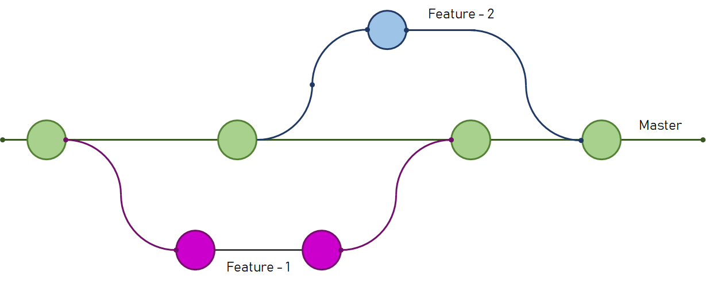

# Contributing to the project

### Workflow

This repository uses a simplified version of the workflow
[Git-flow](https://www.atlassian.com/git/tutorials/comparing-workflows/gitflow-workflow).
A main _branch_ called **master** is used, with the remaining branches being
of type **feat**, **fix**, **doc**, **test** or **chore**, and following
the naming convention below:

```
feat/foo-bar     # a Feature branch
fix/foo-bar      # a Bug Fix branch
doc/foo-bar      # a branch for adding Documentation 
test/foo-bar     # a branch for adding Tests
chore/foo-bar    # other unrelated tasks
```

The name description of the _branch_ must make semantic sense, but does not
follow and rule e.g:
  - __feat__/_criar-armazem_
  - __doc__/_modelo-dominio_

From this approach, the tree-structure will look something like this:



### Pull requests

Merging directly into *master* is now allowed. In order to merge other
branches a **Pull Request** needs to be created. Each __PR__ must link
itself to it's related **Issue**. Multiple branches/PRs can refer to the same
issue. 

A **Pull Request** must contain the type of follow the format:

```
<Type of issue>(<Project>): #<Issue number> - <Description>
```

A few examples:

```
feat(WarehouseMD): #10 modelo Armazém
doc(WarehouseMD): #10 criar Armazém
test(Planning): #11 listar Percurso
fix(WarehouseMD): #20 validacões do Percurso
chore(root): #10 adicionar .dockerfile 
```

The **PR**'s' **description** should contain some reference to the **Issue** in the form
of an action e.g: 

```
Closes #10
References #20
```

### Merge commits

The repository is also configured to **squash** merges into the **master**
branch, therefore the **PR**'s **name** must be used as **message** to the
**merge** commit when manually merging. Additional information can be added.
Example merge-commit message:

```
test(Planning): #11 listar Percurso

Closes #11

Adicionados testes da listagem de Percurso às rotas:
	- GET /percurso
	- GET /percurso/{id}

Testes realizados compreendem os resultados:
	- 200 Successo
	- 404 Percurso inexistente
	- 500 Falha do sistema
```


### Documentation

The documentation follows the [C4 model](https://c4model.com/) approach,
including the following **diagrams** related to the system:

- *N1 (Layer 1)*:
  + **VL - Logical View**: `components diagram` including *Users* and *Application* overview.
  + **VC - Scenarios View**: `use case diagram` including all *Use Cases*

- *N2 (Layer 2)*:
  + **VL - Logical View**: `components diagram` including *Modules*
	(containers), their interfaces and interactions.
  + **VI - Implementation View**: `components diagram` including *Modules* packaging.
  + **VP - Physical View**: `components diagram` including *Modules*, their
	*servers*, network information, communication *protocols* and other
	information about the physical system.

- *N3 (Layer 3)*:
  + **VL - Logical View**: `components diagram` including *Module*'s
	components interactions and interfaces, using the **Onion** architecture.
  + **VI Implementation View**: `components diagram` including *Modules* packaging and relationships.

Each **Use Case** includes a **VP - Process View** diagram. Any Feature must
be submitted with the appropriate documentation related to it's related *Use
Case*, which includes the following diagrams:

- _N1 (Layer 1)_ **VP - Process View**:
  + A sequence diagram including the *User* and the *Application* interaction.
  + Example diagram: [n1-vp-example](/doc/sprintA/N1-VP/n1-vp-example.puml)

- _N2 (Layer 2)_ **VP - Process View**: 
  + A sequence diagram including the *User* and the Application *Modules* (containers) interaction.
  + Example diagram: [n2-vp-example](/doc/sprintA/N2-VP/n2-vp-example.puml)

- _N3 (Layer 3)_ **VP - Process View**: 
  + A sequence diagram including the *User* and the Module *components* interaction.
  + Example diagram: [n3-vp-example](/doc/sprintA/N3-VP/n3-vp-example.puml)

Documentation should be merged toguether with the feature and tests in a
**feature** branch. Missing documentation should be merged in a **doc**
branch. All documentation should be placed in [doc](./doc) directory,
according the current *Sprint*.
