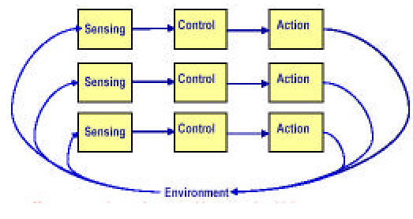
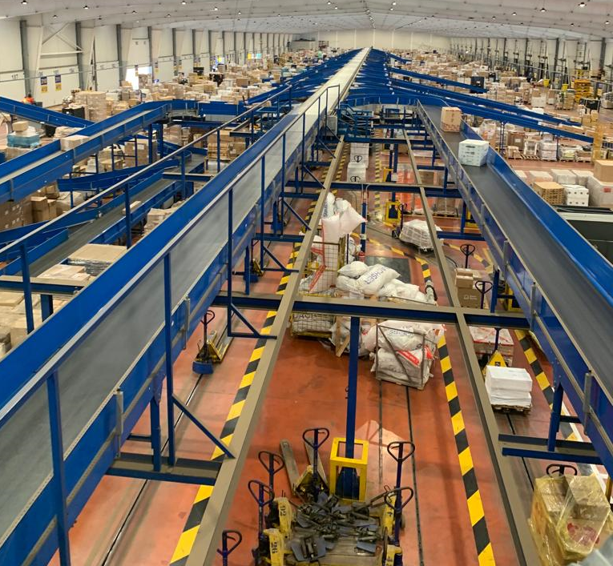
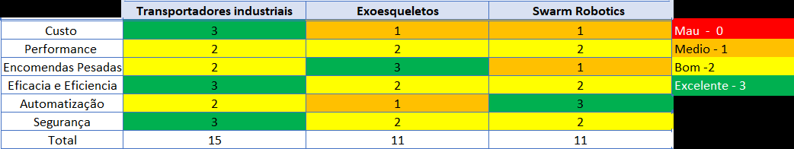

# Estudo de métodos de Robótica Inteligente

## Introdução

A logística, em especial os serviços de entregas obtiveram um enorme
crescimento financeiramente, vendo o seu volume de negócio a aumentar
consideravelmente nos últimos anos. Este aumento deve-se à facilidade das
empresas realizarem as encomendas para curtas ou longas distâncias, em
segurança e sem grandes custos, o que permite uma transação mais confiável
para o cliente.

A chave para este sucesso está no processo usado pelas empresas para
realizarem a tarefa da entrega da encomenda, com destaque para a etapa
last-mile delivery. O last-mile delivery é a última etapa do processo de
transporte de uma encomenda, desde o centro de distribuição até chegar ao
destino final. Portanto, muitas dessas empresas estudaram métodos
automatizados usando a robótica inteligente para concluir o trabalho com maior
rapidez e eficácia e reduzir custos. Neste estudo vamos aprofundar algumas
aplicações da robótica inteligente para executar a etapa last-mile delivery, e
avaliar as suas diferenças, os seus custos, os seus benefícios e as
desvantagens. [1]

## Robótica inteligente

A robótica inteligente faz uso de diferentes campos da engenharia,
nomeadamente o da robótica, que estuda as tecnologias associadas à construção
de robôs de forma a automatizar tarefas de diversas áreas, desde a produção
industrial, medicina até atividades domésticas. [2]

Combina variados campos da engenharia como mecânica, elétrica e informática
mais especificamente pode ser vista como um cruzamento de saberes entre eles:

- Mecânica: Manipuladores, Junções, Locomoção (Acção)  
- Sensores: Peso, Cubicagem (Sentir)  
- Programação: Comandos, Planeamento e Decisão (controlar)  

{width=64%}

\pagebreak

Percebemos com a aprofundação ao estudo da robótica inteligente que esta trata
um conjunto de interações entre as pessoas envolvidas, com os dispositivos e
como estes são programados. Coordenados de modo a que o sistema final seja
coeso e eficiente e seja o menos dispendioso possível. [3] 

## Aplicação da tecnologia no problema

O objetivo do nosso problema visa a distribuição de várias encomendas entre os
diversos camiões da nossa frota. Para atingirmos o melhor resultado vamos usar
aquilo que aprendemos com o nosso estudo, portanto vamos usar um processo
começando por analisar os dados com uso de sensores (1) , depois vamos fazer o
controle desses dados e tomar uma decisão (2) e por fim tomamos a ação (3) de
colocar a encomenda no camião.

1. Sendo assim a encomenda é identificada. (através de um scan código de
   barras ou código QR) De modo a processar qual o destino que tem a
   encomenda, depois os restantes sensores fazem o cálculo do peso da
   encomenda e da cubicagem, importante para o algoritmos processar para que
   camião serão colocados.

2. Após serem recolhidos os dados sobre as encomendas e com uso do algoritmo
   vai ser tomada a decisão de qual o camião a receber a encomenda. O sistema
   já possui todas as informações dos camiões que estão prontos a receber
   encomendas e assim toma rapidamente a sua decisão para cada encomenda.

3. Para que não haja interrupções no fluxo, essa decisão é compreendida pelos
   robôs, que neste caso são os transportadores industriais que tomam a ação
   de transportar a encomenda até o respectivo camião. Na figura 2 temos como
   exemplo um armazém que usa este método para realizar as suas distribuições.
   [4]

{width=50%}

\pagebreak

## Outras utilizações da robótica inteligente

### Swarm Robotics

É possível realizar a distribuição de mercadorias a partir de um grupo de
robôs que em maiores quantidades conseguem realizar o trabalho com maior
rapidez. São coordenados para que juntos realizem a tarefa o mais rápido
possível, conectados por wi-fi e controlados por um sistema com uma câmera que
capta a posição dos robôs e os distribui pelas tarefas.

Os custos para a construção de um robô ficam aproximadamente pelos cem euros
pelos materiais necessários, mais o trabalho para a construção dos robôs e a
montagem do sistema, um serviço que custaria cerca de dois mil euros por cada
robô. [5]

### Exoesqueletos

Os exoesqueletos são robôs utilizados para melhorar a performance do ser
humano para a realização de trabalhos manuais, que demandam um grande esforço
físico por parte dos trabalhadores. Esta tecnologia não consegue realizar uma
distribuição tão automatizada como a que foi proposta na aplicação ao
problema, mas têm grandes benefícios para os trabalhadores. O custo de cada
exoesqueleto é aproximadamente mil euros. [6]

### Comparação entre as tecnologias

Avaliando todas as tecnologias realizamos uma comparação entre as suas mais
valias, as suas desvantagens e os custos associados à utilização das
tecnologias. Assim apresentamos na tabela seguinte os resultados obtidos do
estudo onde atribuímos uma escala sendo zero o pior resultado e três o melhor.

As seguintes categorias usadas para avaliar as tecnologias estudadas têm a ver
com as necessidades presentes para executar a tarefa de separar as encomendas
pela frota. Daí o custo para implementar a tecnologia no negócio; a
performance geral que a tecnologia tem dentro e fora do projeto ou do negócio
a ser implementado; como se comporta ao suportar encomendas de grande porte e
peso; Eficácia e Eficiência da tecnologia aplicada sobre o negócio queremos
avaliar rapidez da tomada de decisão e da colocação do ponto inicial até ao
camião; a automatização avalia até que nível a tecnologia pode executar a
totalidade das tarefas; e a segurança das tecnologias ao meio de trabalho.

\pagebreak

Concluímos com a tabela da figura 3 que a melhor tecnologia para a aplicar num
armazém de distribuição para que este seja mais lucrativo serão os
transportadores industriais. No geral são mais práticos, trazem melhores
resultados e são menos dispendiosos.

## Desenvolvimentos futuros

A importância da robótica inteligente no futuro de negócios como este da
distribuição de mercadorias é essencial numa perspetiva de gestão, para que a
empresa consiga ser mais competitiva pelo mercado, e com recurso a estas
tecnologias e a automatização dos seus serviços, sendo a criar postos de
distribuição inteligente ou outros, é uma mais valia como investimento.

Ao mesmo tempo, conseguimos obter um objetivo importante a nível mundial com a
globalização do comércio. Possível para as empresas hoje em dia sem grandes
custos como é possível perceber pelo estudo.

\pagebreak
