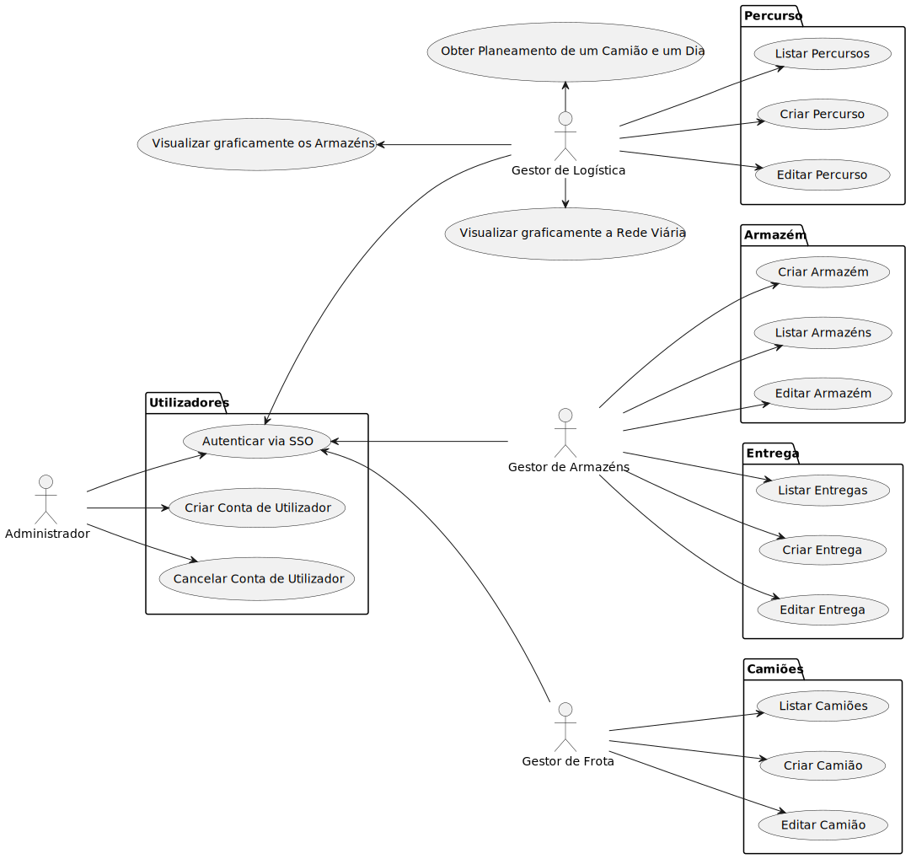
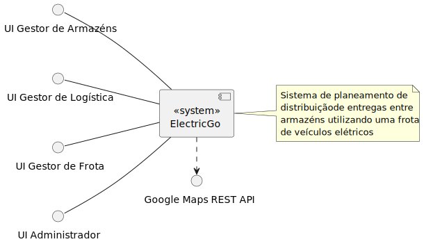
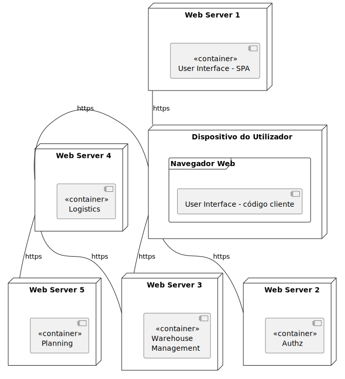
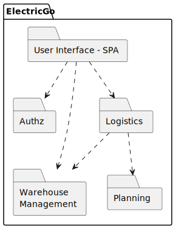
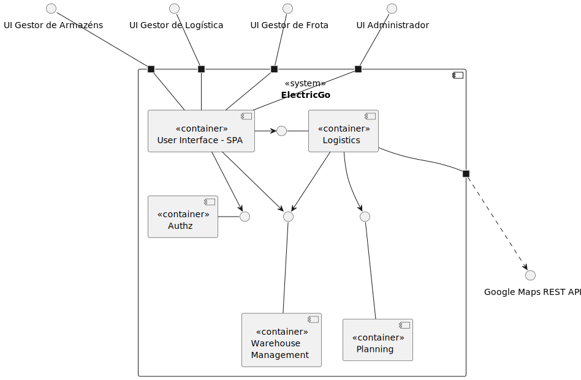
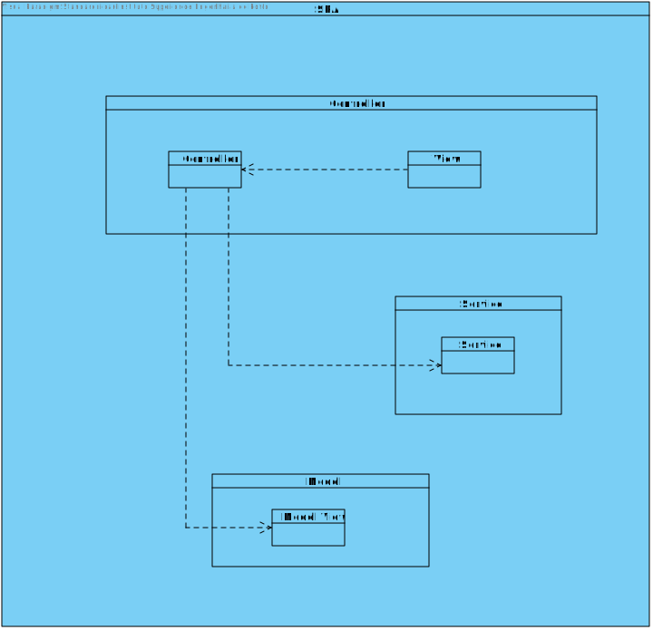
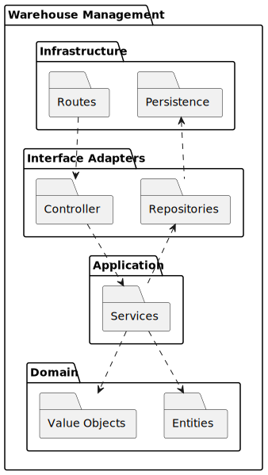
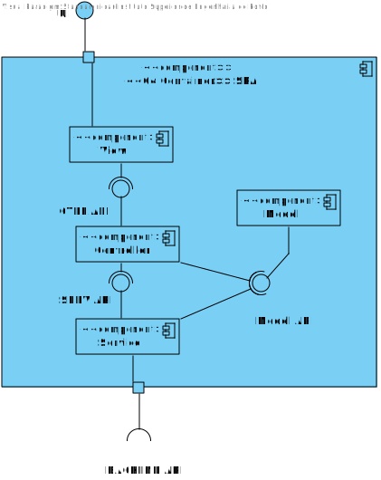
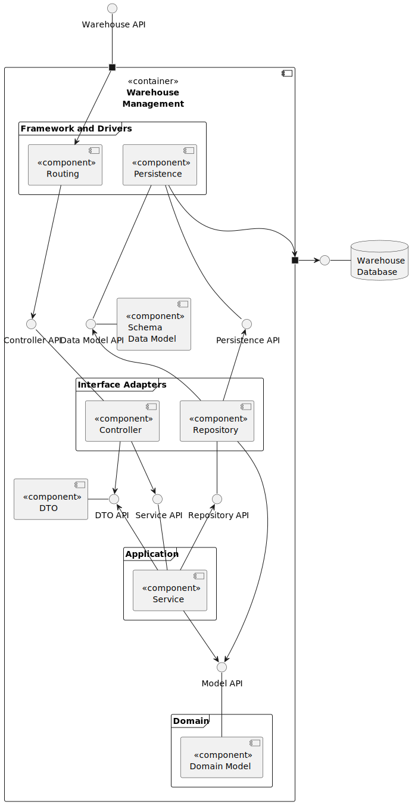

## Sprint B

### UCs

- [UC-27](./UC-27.md)  
- [UC-28](./UC-28.md)  
- [UC-29](./UC-29.md)  
- [UC-30](./UC-30.md)  
- [UC-31](./UC-31.md)  

### Diagramas
index.md

#### N1-VC

#### N1-VL

#### N2-VF

#### N2-VI

#### N2-VL

#### N3-VI-SPA

#### N3-VI

#### N3-VL-SPA

#### N3-VL

